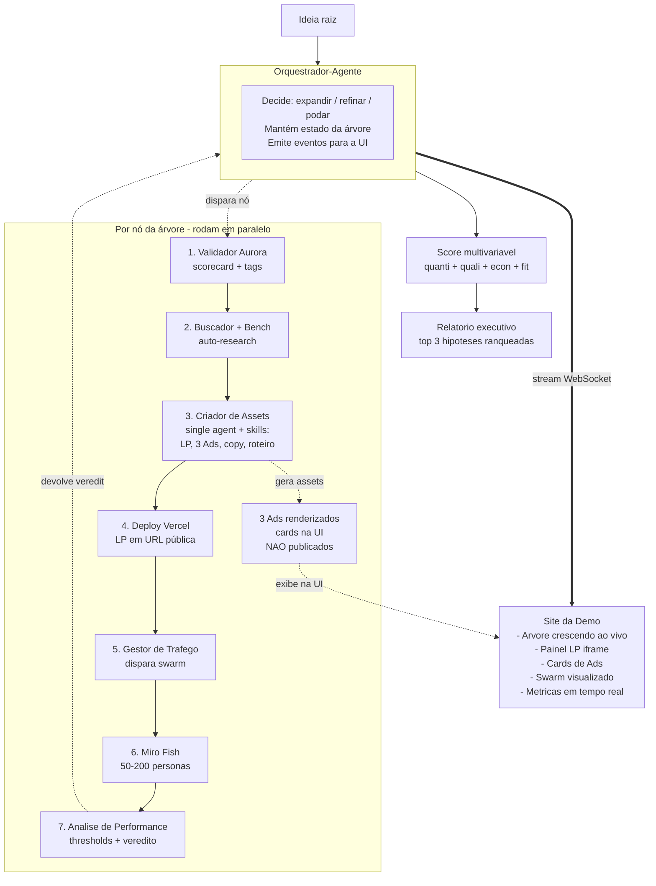

# Arquitetura — Autovalidador de Ideias em Escala
**Beyond Agents · Hackathon · Versão final consolidada**

---

## 1. Sumário executivo

Pipeline agêntico em padrão **Orchestrator-Workers** que recebe uma submissão (formulário de aplicação da Aurora preenchido pelo founder, ou prompt livre na demo) e devolve um **score multivariável** após explorar uma **árvore de hipóteses**. Cada nó da árvore: gera **1 LP + 3 ads** como assets reais, sobe a LP em URL pública (Vercel), dispara um swarm de **personas sintéticas (Miro Fish)** para validar tração, e devolve veredito ao orquestrador, que decide **expandir, refinar ou podar**. Toda a exploração é visualizada **ao vivo** em um site dedicado.

A solução **não substitui** decisão de investimento — alimenta o Comitê Aurora com dados que hoje custam pessoas + semanas, em **dias**. O input é o **formulário de submissão Aurora** (estruturado em 5 blocos: Founders, Solução, Progresso, Problema & Mercado, Expectativas — schema completo em §15), o que destrava o uso direto do scorecard oficial da Fase 1 e dá ao Validador Aurora evidência de campo para quase todos os critérios.

## 2. Princípios arquiteturais

1. **Orchestrator-Workers**, não multi-agente colaborativo. Um agente orquestrador coordena agentes workers especialistas. Workers não falam entre si. Auditável, demonstrável, sem bouncing infinito.
2. **Single agent + skills** para escrita coordenada. O Criador de Assets é UM agente com 4 skills (LP, ads, copy, roteiro) — garante coerência de mensagem entre LP e ads.
3. **Stateless por execução**. Estado da árvore vive no orquestrador, em-process ou Redis. Sem persistência cara.
4. **Caps como envelope, não como cérebro**. Profundidade, fan-out, budget e timeout são guard-rails determinísticos. Tudo o que está **dentro** do envelope é decisão agêntica.
5. **Não-automação da decisão final**. Sistema entrega score acionável. Comitê Aurora decide investimento. Isso é maturidade arquitetural, não limitação.

## 3. Inventário de agentes

| # | Agente | Tipo | Função | Output |
|---|---|---|---|---|
| 1 | **Orquestrador** | Agente LLM | Recebe ideia, expande sub-hipóteses, decide podar/expandir/refinar a cada veredito, emite eventos para a UI | Estado da árvore + score final |
| 2 | **Validador Aurora** | Agente LLM | Consome o formulário Aurora completo (§15) e roda o scorecard do Playbook de Seleção sobre a hipótese — 12 critérios gerais + critérios específicos de Mercado/Inorgânico (perfil do founder, dono da briga, sinergia operacional). Não é gate booleano: sempre roda até o fim, atribui notas, calcula score parcial de fit estratégico, exceção é o **veto regulatório**. Detalhe em §4. | Score parcial + critérios + tags de tese + recomendação |
| 3 | **Buscador / Análise de Concorrentes** | Agente LLM | A partir do dossiê do formulário Aurora, **valida e enriquece** as afirmações do founder: confere TAM/SAM/SOM, confronta a lista de concorrentes com benchmark de mercado, identifica concorrentes não-listados, levanta dores e tendências do segmento. Reusa skill de benchmark de LPs existente. | Dossiê estruturado consolidado (formulário + research) |
| 4 | **Criador de Assets** | Single agent + skills | Gera os artefatos da hipótese. Skills: `gerar-lp`, `gerar-ads` (3 variações), `gerar-copy`, `gerar-roteiro-video` (opcional) | LP (HTML+Tailwind) + 3 Ads (imagem+copy) |
| 5 | **Gestor de Tráfego** | Agente LLM | Recebe a LP deployada, dispara o swarm sintético contra ela | Trigger do Miro Fish |
| 6 | **Miro Fish (swarm)** | N mini-agentes LLM | Cada persona sintética analisa a LP (HTML+copy) e responde: achou interessante? clicaria? pagaria? feedback estruturado | Pool de respostas por persona |
| 7 | **Análise de Performance** | Agente LLM | Agrega respostas do swarm, compara com thresholds, devolve veredito (ok / refinar / podar) | Veredito + métricas da LP |

**Total: 6 agentes especialistas + 1 orquestrador + N personas Miro Fish (50–200 por LP).**

## 4. Validador Aurora — o que ele vê e quando dá o "check"

O Validador Aurora é o **único agente que carrega conhecimento institucional da Beyond**. Ele é a tradução automatizada do scorecard que o Comitê de Inovação aplica hoje na Fase 1 (Screening) do [Playbook de Seleção](/Users/gplopes/Downloads/29a89955-04ab-47cf-bed9-cdd1a21077b7_Playbook_de_Seleo_.pdf).

### 4.1 Princípio: não é gate booleano

Ele **não decide** sozinho se a hipótese segue ou para. Em vez disso:

- Sempre roda até o fim, mesmo em ideias fracas.
- Atribui **notas por critério** com justificativa em texto.
- Calcula uma **nota parcial de fit estratégico** que alimenta a dimensão "Fit" do score multivariável (§9).
- Anexa **tags estruturadas** de aderência às teses (vertical, modelo, estágio).
- Devolve a **recomendação de corte do Playbook** ("descartar", "validar", "prioridade").
- Tem **uma única exceção que poda imediatamente**: veto regulatório (critério 10 com nota 1 — barreiras jurídicas que inviabilizam o modelo).

Isso preserva o princípio "não automatizamos o Comitê, alimentamos ele": o sistema sempre devolve um diagnóstico, mesmo quando ele recomenda descarte. A decisão final segue sendo humana.

### 4.2 Critérios aplicáveis ao nosso contexto

O scorecard do Playbook tem três camadas:

- **Geral** — 60% do peso final no Playbook original. Vale para qualquer fonte de oportunidade.
- **Específico por fonte** — 40%: Editais (PI, atestados técnicos, ROI burocrático…), Mercado/Inorgânico (perfil do founder, sinergia operacional…), Interno (disponibilidade do owner, dono da briga…).

**Mudança de premissa importante:** o autovalidador recebe como input o **formulário de submissão Aurora** preenchido pelo founder (schema completo em §15). O formulário traz bloco completo de Founders (background, trajetória, LinkedIn, conquistas, tempo de dedicação) e dados financeiros/operacionais (cash balance, burn rate, projeção, stack, canais). Isso destrava o uso dos critérios específicos de **Mercado/Inorgânico** e **Interno** — antes considerados fora do escopo. Editais continuam fora (exigem atestados, propriedade intelectual, fluxo burocrático que só faz sentido em submissão de proposta concreta).

**Critérios aplicáveis no MVP:** os 12 gerais + 4 específicos de Mercado/Inorgânico/Interno.

#### Scorecard geral (12 critérios)

Cada critério é uma **pergunta que o LLM responde** com base no formulário Aurora preenchido + dossiê do Buscador. A "Fonte de evidência" indica o campo do formulário que sustenta a nota — e quando o Buscador valida/desafia esse claim.

| # | Critério | Pergunta | Peso original | Fonte de evidência (formulário ↔ research) |
|---|---|---|---|---|
| 1 | Diferencial Injusto / Moat | A ideia tem tecnologia própria, dados ou posição de mercado defensáveis? | 10% | Campo *"Por que somos os melhores? Tecnologia própria, dados exclusivos, posição única?"* + validação cruzada com benchmark de concorrentes |
| 2 | Alinhamento de Tese | Está em vertical priorizada (LegalTech, EdTech, HealthTech, GovTech) ou gera valor para parceiros atuais do Extreme? | 10% | Campo *"Vertical"* (botão direto) + inferência do Validador a partir de Solução + Problema |
| 3 | Problema Real | Resolve dor latente e comprovada — não é "solução em busca de problema"? | 10% | Campos *"Qual dor latente esta solução resolve? Existem evidências?"* + *"Por que escolheu desenvolver essa ideia?"* + cross-check com swarm |
| 4 | TAM/SAM/SOM | O tamanho do prêmio vale o esforço? | 10% | Campo *"Qual TAM, SAM e SOM aproximado?"* declarado + validação do Buscador (estimativa de mercado) |
| 5 | Escalabilidade Tecnológica | Receita cresce sem aumento proporcional de custo (negócio de tecnologia, não de serviço)? | 10% | Campo *"Modelo permite crescimento sem aumento proporcional de custos?"* + Stack tecnológico declarado |
| 6 | Escalabilidade Pública (B2G) | Tem potencial em canal público / editais? | 10% | Vertical declarada + Expectativas (*"Contatos B2G"*) + inferência do Validador |
| 7 | Aproveitamento de Infra Beyond | Usa governança ou IA do grupo? | 5% | Campo *"É possível reduzir custos/CAC usando infra Beyond?"* (Sim/Não direto) |
| 8 | Velocidade MVP | Teste funcional viável em 1–4 semanas? | 10% | Campo *"É possível testar MVP em até 4 semanas?"* (texto + explicação) |
| 9 | Pesquisa Pesada vs Vibe Coding | Exige pesquisa demorada (não-trivial em IA)? | 5% | Campo *"Stack tecnológico"* + complexidade inferida pelo Validador |
| 10 | **Risco Regulatório — VETO** | Existem barreiras regulatórias/jurídicas que inviabilizam o modelo? Nota 1 aciona poda imediata. | 10% | Campo *"Existe alguma barreira legal imediata?"* (Sim/Não direto) + auto-research jurídico do setor |
| 11 | Conhecimento Interno | A Beyond já sabe fazer algo similar? | 5% | Stack declarado + comparação com portfólio Beyond/Aurora conhecido |
| 12 | Processo Comercial | O time comercial já sabe vender isso (canal aberto)? | 5% | Campo *"Possui acesso direto a canais de venda?"* + Background do founder (LinkedIn, histórico) |

#### Scorecard específico — Mercado / Inorgânico / Interno

| # | Critério | Pergunta | Peso original | Fonte de evidência (formulário) |
|---|---|---|---|---|
| 13 | Perfil do Founder | Owner tem perfil empreendedor, resiliência, foco em resultados? | 20% (do bloco) | Bloco Founders inteiro: Educação, Histórico de trabalho, LinkedIn, Conquistas |
| 14 | Dono da Briga | Há responsável claro que dedicará tempo necessário à incubação? | 20% | Campo *"Há quanto tempo cada um está trabalhando nisso?"* + Expectativas |
| 15 | Sinergia Operacional / CAC | Conseguimos reduzir custos ou CAC usando infra Beyond? | 20% | Mesmo do critério 7 (Sim/Não direto) — alta correlação |
| 16 | Canais de Venda | Owner tem acesso direto aos canais ou rede necessária para validar? | 20% | Mesmo do critério 12 — alta correlação |

Como os critérios 7&15 e 12&16 são altamente correlacionados, na prática o Validador **deduplica e ajusta peso** (regra de implementação: se ambos pontuam, peso médio entra duas vezes; se um é mais granular, prevalece).

**Reescalonamento de pesos:** como editais (40% da camada específica) ficam fora, o peso reescalonado fica em ~83% (60% gerais + 20% Mercado/Inorgânico). O Validador normaliza para 100 no output final.

### 4.3 Tags da Tese de Investimento Aurora

Além das notas, o Validador anexa **tags** baseadas na tese de investimento explícita da Aurora (também no Playbook de Seleção). Não pesam no score — pesam na leitura visual do nó na UI:

- `vertical-priorizada-{legaltech | edtech | healthtech | govtech}` ou `vertical-fora-da-tese`
- `modelo-{b2b | b2g | b2c}` (B2C ganha alerta "fora da tese explícita")
- `estagio-{ideacao | validacao | early-stage}`
- `conveniencia-pessoas` se a ideia bate com o propósito "produtos digitais que trazem conveniência para a vida das pessoas"

### 4.4 Recomendação de corte (oriunda do Playbook)

O Playbook define cortes objetivos para o score do screening — usamos os mesmos:

| Score parcial Aurora | Recomendação no Playbook | O que aparece na UI |
|---|---|---|
| `< 60` | Descartar ou colocar no backlog | Badge vermelha "Fora de tese" |
| `60 – 80` | Validar hipóteses específicas e amadurecer | Badge amarela "Validar" |
| `> 80` | Prioridade | Badge verde "Prioridade Aurora" |
| VETO acionado (critério 10 = 1) | Pausar | Nó podado imediatamente, motivo visível |

A recomendação aparece como rótulo no nó, mas **não bloqueia a continuação do pipeline** (exceto VETO). É um dos inputs que o Orquestrador-Agente considera ao decidir expandir/refinar/podar.

### 4.5 Input e output do agente

**Input** (JSON) — o formulário Aurora completo + a hipótese específica do nó da árvore + o dossiê do Buscador:

```json
{
  "submissao_aurora": {
    "founders": [
      {
        "nome": "...", "telefone": "...", "email": "...",
        "genero": "...", "data_nascimento": "...", "cidade": "...",
        "redes_sociais": "...",
        "educacao": "...", "historico_trabalho": "...",
        "linkedin": "...", "conquistas": "..."
      }
    ],
    "solucao": {
      "nome": "...",
      "descricao_50_chars": "...",
      "por_que_escolheu": "...",
      "vertical": "legaltech | edtech | healthtech | govtech | outra",
      "pitch_deck_url": "...",
      "video_demo_url": "..."
    },
    "progresso": {
      "tempo_de_trabalho": "...",
      "cash_balance_e_burn_rate": "...",
      "projecao_faturamento": "...",
      "stack_tecnologico": "...",
      "reduz_custos_com_infra_beyond": true,
      "mvp_em_4_semanas": "..."
    },
    "problema_mercado": {
      "por_que_essa_ideia": "...",
      "dor_latente_e_evidencias": "...",
      "publico_problema_solucao": "...",
      "diferencial_moat": "...",
      "concorrentes_e_lacunas": "...",
      "tam_sam_som": "...",
      "escalabilidade_sem_custo_proporcional": "...",
      "canais_de_venda": "...",
      "barreira_legal_imediata": false
    },
    "expectativas": {
      "convencimento": "...",
      "areas_de_ajuda": "..."
    }
  },
  "hipotese_no_no": "Foco em MEIs do setor de alimentação, canal WhatsApp",
  "dossie_buscador": {
    "concorrentes_validados": ["..."],
    "concorrentes_omitidos_pelo_founder": ["..."],
    "tam_sam_som_validado": "...",
    "dores_confirmadas": ["..."],
    "tendencias": ["..."]
  }
}
```

**Output** (JSON):

```json
{
  "score_parcial_fit": 72,
  "veto": false,
  "criterios": [
    {
      "id": "alinhamento_tese",
      "nota": 9,
      "peso_normalizado": 12.0,
      "fonte": "formulario.solucao.vertical = legaltech",
      "justificativa": "LegalTech é vertical priorizada explícita da Aurora."
    },
    {
      "id": "risco_regulatorio",
      "nota": 5,
      "peso_normalizado": 12.0,
      "veto": false,
      "fonte": "formulario.problema_mercado.barreira_legal_imediata = false (founder) + auto-research (validado)",
      "justificativa": "Founder declarou sem barreira. Auto-research confirmou: setor regulado pela OAB, mas com precedentes de orientação não-vinculante. Não veta."
    },
    {
      "id": "perfil_founder",
      "nota": 8,
      "peso_normalizado": 16.0,
      "fonte": "formulario.founders[0].historico_trabalho + linkedin",
      "justificativa": "Histórico de 7 anos em fintech, fundou empresa anterior, perfil empreendedor consistente."
    },
    "..."
  ],
  "tags": ["vertical-priorizada-legaltech", "modelo-b2b", "estagio-ideacao", "conveniencia-pessoas"],
  "recomendacao_playbook": "validar",
  "discrepancias_founder_vs_research": [
    {
      "campo": "tam_sam_som",
      "founder": "R$ 5Bi TAM",
      "research": "Estimativa do Buscador: R$ 800Mi - R$ 1.2Bi TAM",
      "severidade": "alta"
    }
  ]
}
```

Esse output plugga direto na **dimensão "Fit estratégico"** da fórmula do score multivariável final (§9), e cada `criterio` vira uma linha no painel lateral do nó na UI. O campo `discrepancias_founder_vs_research` é exibido como alerta visual — sinal importante de honestidade da submissão.

### 4.6 O que o Validador Aurora explicitamente NÃO faz

Fronteiras desenhadas de propósito:

- Não faz **due diligence** do founder (não conferimos LinkedIn manualmente, não cruzamos referências, não validamos diplomas). Avaliamos o perfil **como declarado no formulário**, com sinais auxiliares do auto-research. Confirmação de identidade e antecedentes continua sendo do time Aurora.
- Não calcula **modelagem financeira completa** — isso é a Fase 1 do [Playbook de Ongoing](/Users/gplopes/Downloads/202858a5-89c1-453d-8c67-f35048318bc7_Playbook_de_Ongoing_.pdf), que acontece **depois** do nosso autovalidador. Lemos o cash balance e a projeção que o founder declarou, mas não construímos a projeção 5a Triple-Triple-Double-Double-Double.
- Não verifica **atestados técnicos** nem propriedade intelectual de editais (relevante apenas para editais, fase posterior, exige documentação formal).
- Não decide **investimento** — sinaliza fit estratégico para o score final e para o Comitê humano.
- Não aprende sozinho — o scorecard é parametrizado; mudanças vêm do time Aurora, não do modelo.

Essa fronteira clara é parte da maturidade da solução: cada coisa no lugar certo.

## 5. Fluxo de uma hipótese (espinha sequencial)

Dentro de **cada nó da árvore** (uma hipótese), o pipeline é o do quadro original:

```
[hipótese ativa]
   ↓
1. Validador Aurora      → score + tags
   ↓
2. Buscador / Bench      → dossiê
   ↓
3. Criador de Assets     → LP + 3 Ads (assets reais)
   ↓
4. Deploy Vercel         → URL pública da LP
   ↓
5. Gestor de Tráfego     → dispara swarm
   ↓
6. Miro Fish             → N personas analisam LP
   ↓
7. Análise de Performance → veredito + métricas
   ↓
[veredito devolve ao Orquestrador]
```

Ads são gerados, **renderizados como cards na UI**, mas **não publicados**. No pitch: *"a publicação está mapeada para a próxima fase; os assets já saem prontos."*

## 6. Plano de controle — árvore de hipóteses

O Orquestrador-Agente mantém o estado da árvore e decide a cada veredito. Operações disponíveis:

- **Expandir nó**: gerar N sub-hipóteses (variações de público, ângulo, formato).
- **Refinar nó**: voltar ao Criador de Assets com instrução de variação, gerando nova LP+Ads no mesmo nó.
- **Podar nó**: marcar como morto, encerrar exploração desse caminho.
- **Promover nó**: marcar como candidato ao score final.

Estados visíveis na UI por nó:

| Estado | Cor | Significado |
|---|---|---|
| `gerando` | cinza pulsando | Hipótese definida, assets em construção |
| `deployada` | azul | LP no ar, aguardando swarm |
| `validando` | animação | Miro Fish rodando |
| `aprovada` | verde | Passou nos thresholds |
| `refinando` | laranja | Voltou pro Criador para variação |
| `podada` | cinza riscado | Não bateu critério, encerrada |
| `promovida` | dourada | Top candidata ao score final |

## 7. Plano visual — site da demo

Esse é **o produto da apresentação**.

### Tela 1 — Home

Dois modos de input no MVP:

- **Modo formulário Aurora** (modo "produção", também usado se a demo for de uma submissão real): a Home renderiza o formulário completo da Aurora em 5 blocos (Founders, Solução, Progresso, Problema & Mercado, Expectativas — schema em §15). Pode ser preenchido ao vivo ou pré-carregado a partir de um JSON.
- **Modo prompt livre** (modo "wow" para o palco): um único campo de texto. Ao submeter, um agente auxiliar **auto-completa** os 5 blocos do formulário Aurora a partir do prompt + auto-research, e exibe rapidamente o que preencheu para o avaliador conferir/ajustar antes de seguir.

Em ambos os modos, o que entra no Orquestrador é o mesmo JSON do formulário Aurora completo. Botão "Validar" navega para a tela da árvore.

### Tela 2 — Árvore ao vivo (centro)

Árvore interativa (React Flow), crescendo em tempo real conforme o orquestrador expande nós. Cada nó é card com:

- Título da hipótese.
- Estado visual (cor + animação).
- Métricas resumidas (conversão, intenção).

### Tela 3 — Painel lateral (ao clicar num nó)

Abre painel mostrando:

- **Iframe da LP** renderizada (a URL Vercel).
- **3 cards de Ads** gerados para essa LP, com badge "Pronto para publicação — próxima fase".
- **Feed ao vivo** das personas Miro Fish: cada análise aparece como uma linha ("Persona #47 — 28a, gerente de operações: *'achei interessante, mas não entendi o preço'*. Não converteu.").
- **Dashboard** de métricas em tempo real: bounce rate, scroll depth proxy, CTA click rate sintético, % que converteria.

### Tela 4 — Resultado final

Quando a árvore estabiliza (ou bate o cap):

- **Top 3 hipóteses ranqueadas** pelo score multivariável.
- **Relatório executivo** gerado (1 página) para o Comitê Aurora.
- **Custo total** da exploração (em tokens + tempo).

## 8. Caps e guard-rails

Envelope determinístico que protege a demo e o budget:

| Parâmetro | Valor demo | Para quê |
|---|---|---|
| `MAX_DEPTH` | 2 (raiz → filhos → netos) | Árvore legível na tela |
| `MAX_FAN_OUT_POR_NÓ` | 3 sub-hipóteses | Cabe sem ficar denso |
| `MAX_NÓS_TOTAL` | ~10–12 | Cabe em 2–3 min de demo |
| `MAX_PERSONAS_POR_LP` | 50 (com upgrade para 200 se a infra aguentar) | Suficiente para sinal estatístico no swarm |
| `TOKEN_BUDGET_POR_NÓ` | 50k | Custo por hipótese ≈ $0.10–0.20 |
| `TIMEOUT_POR_NÓ` | 90s | Se passar, marca `timeout` (estado visual) |
| `MAX_REFINAMENTOS` | 1 por nó | Mostra refinamento sem loop infinito |

Os caps **não bloqueiam** a apresentação visual — eles **garantem** que a árvore cresça até um tamanho demonstrável e pare em tempo apresentável.

## 9. Score multivariável final

A saída final agrega 4 dimensões (alinhada com o que a Aurora já usa no Vesting 1):

| Dimensão | O que mede | Fonte |
|---|---|---|
| **Sinais quantitativos** | Conversão proxy, intenção de compra, CTR sintético | Miro Fish |
| **Sinais qualitativos** | % "muito decepcionado" sem o produto (proxy Sean Ellis), feedback estruturado | Miro Fish (perguntas estruturadas às personas) |
| **Sinais econômicos** | CAC estimado, range de LTV, custo total da validação | Heurística + custo real em tokens |
| **Fit estratégico** | Aderência às teses Beyond/Extreme, vertical priorizada | Validador Aurora |

Fórmula simples para a demo: `score = w1·quanti + w2·quali + w3·econ + w4·fit`, com pesos visíveis na UI (slider para o avaliador ajustar e re-ranquear).

## 10. Stack técnica

Tudo TypeScript, deploy único, mínima troca de contexto:

| Camada | Escolha | Por quê |
|---|---|---|
| **Frontend** | Next.js + Tailwind + shadcn/ui | UI bonita em horas |
| **Árvore visual** | React Flow | Pronto, performático, customizável |
| **Realtime** | Socket.io (ou Liveblocks) | Stream de eventos orquestrador → UI |
| **Agentes** | Mastra **ou** Vercel AI SDK | TS-first, streaming nativo, workflows |
| **Deploy de LPs** | Vercel API | LP no ar em segundos |
| **Modelos** | Claude Sonnet 4 (workers) + Haiku/GPT-4o-mini (personas Miro Fish) | Mistura custo/qualidade |
| **Estado** | Em-process (Redis se houver tempo) | Stateless por execução |

## 11. Diagrama final



## 12. Cronograma para amanhã (10–12 horas, 4–5 pessoas)

| Trilha | Owner | Tempo | Entregável |
|---|---|---|---|
| **Backend agêntico** — orquestrador + 6 workers em Mastra/Vercel SDK | 2 pessoas | 5h | Pipeline completo rodando em CLI |
| **Miro Fish** — pool de personas + perguntas estruturadas + agregação | 1 pessoa | 4h | Swarm sintético contra qualquer LP, devolvendo métricas |
| **Frontend** — Next.js + React Flow + Socket.io + iframe LPs | 1–2 pessoas | 6h | Site mostrando árvore ao vivo + painel LP/Ads |
| **Deploy de LPs** — integração Vercel API | 1 pessoa (parcial) | 2h | LP gerada vira URL pública em segundos |
| **Integração ponta a ponta + testes** | Todos | 2h | Tudo conectado, demo rodando |
| **Roteiro + rehearsal** | 1 pessoa em paralelo | 2h | Script de 5 min + plano B se algo travar |

**Caminho crítico**: Miro Fish (mais arriscado, começa cedo) + WebSocket orquestrador → frontend (integração mais frágil). Trabalhar esses dois em paralelo desde a hora 1.

## 13. Pontos do pitch que vendem maturidade

- **"Orchestrator-Workers, não swarm"**: explica a escolha arquitetural e mostra que o time sabe a diferença.
- **"Caps determinísticos como envelope, decisão agêntica dentro"**: combina o melhor dos dois mundos, foge do antipadrão "agente faz tudo".
- **"Ads gerados, não publicados — próxima fase"**: honesto sobre o escopo do hackathon, sem prometer o que não está pronto.
- **"Não substituímos o Comitê Aurora, alimentamos ele"**: posicionamento maduro contra automação cega.
- **"Score multivariável, não veredito binário"**: pega o insight do Rodrigo sobre produtos com retorno modesto + custo baixíssimo de validação.
- **"~$0.10–0.20 por hipótese vs. semanas de pessoa"**: número claro de ROI para o júri.

## 14. O que ficou fora deliberadamente (mostrar no pitch como "next phase")

- Publicação real de ads no Meta.
- Plano paralelo de Tendências contínuas (na demo, snapshot pré-coletado alimenta o Criador).
- Loop de refinamento profundo (na demo, máximo 1 refinamento por nó).
- Persistência cross-execução (na demo, estado em-process).
- Avaliação de performance dos próprios ads (só LP via swarm).

Cada um desses é uma frase no pitch: *"a v2 adiciona X, mapeada e estimada."*

## 15. Esquema do formulário Aurora (input do sistema)

O formulário de submissão da Aurora é o **input canônico** do autovalidador. Ele tem 5 blocos sequenciais, e cada campo carrega evidência direta para os critérios do scorecard. O Validador Aurora consome o JSON completo; o Buscador valida e enriquece; o Criador de Assets puxa contexto de produto e público; o Score Final usa os dados econômicos.

### 15.1 Blocos do formulário

**1. Founders** (lista, ≥1, com botão "Adicionar"):

- *Básico*: Nome completo, Telefone, Email, Gênero, Data de nascimento, Cidade, Redes sociais.
- *Background e trajetória*: Educação, Histórico de trabalho, LinkedIn, Conquistas que se orgulha.

**2. Solução**:

- Nome da solução.
- Descrição em ≤50 caracteres.
- Por que escolheu essa ideia + experiência prática.
- **Vertical** (botão): LegalTech / EdTech / HealthTech / GovTech / Outra.
- Pitch Deck (URL, opcional).
- Vídeo de Demo até 5min (URL, opcional).

**3. Progresso**:

- Há quanto tempo cada founder está trabalhando nisso.
- Cash balance atual e burn rate mensal (previsão aceita se ainda não fatura).
- Projeção de faturamento (números + premissas).
- Stack tecnológico (incluindo modelos de IA e ferramentas de programação IA).
- **É possível reduzir custos / CAC usando a infra de IA e automação da Beyond?** (Sim/Não).
- **É possível testar MVP em até 4 semanas?** (Sim/Não + explicação).

**4. Problema & Mercado**:

- Por que essa ideia + como sabe que as pessoas precisam.
- Qual dor latente + evidências/dados que comprovam.
- "Para [Públicos/Clientes] que têm [Problema], oferecemos [Solução/Produto]" (pitch one-liner).
- **Por que somos os melhores?** Tecnologia própria, dados exclusivos, posição única.
- Principais concorrentes + o que eles ainda não entenderam.
- TAM, SAM, SOM aproximado.
- O modelo permite crescimento de receita sem aumento proporcional de custos?
- Possui acesso direto a canais de venda?
- **Existe alguma barreira legal imediata?** (Sim/Não).

**5. Expectativas**:

- O que convenceu a aplicar ao modelo de Venture Builder da Beyond.
- Em quais áreas espera receber mais ajuda (Vendas, Desenvolvimento, Jurídico, Contatos B2G…).

### 15.2 Mapeamento campo ↔ critério do scorecard

Resumo de quais campos sustentam quais critérios do scorecard (§4.2). Pode ser usado pelo Validador como prompt-template — ele sabe ler diretamente cada campo.

| Critério | Campo principal | Fonte secundária |
|---|---|---|
| 1. Moat | *Por que somos os melhores?* | Stack tecnológico, Background do founder |
| 2. Alinhamento de Tese | *Vertical* | Solução + Problema |
| 3. Problema Real | *Dor latente + evidências* | *Por que essa ideia* |
| 4. TAM/SAM/SOM | *TAM/SAM/SOM aproximado* | Validação do Buscador |
| 5. Escalabilidade Tec | *Modelo permite crescimento sem aumento proporcional* | Stack |
| 6. Escalabilidade Pública | *Vertical* + *Expectativas (B2G)* | — |
| 7. Infra Beyond | *Reduz custos/CAC com infra Beyond?* (booleano) | — |
| 8. Velocidade MVP | *MVP em 4 semanas?* | Stack |
| 9. Pesquisa vs Vibe | Stack tecnológico | — |
| **10. VETO Regulatório** | ***Barreira legal imediata?*** (booleano) | Auto-research jurídico |
| 11. Conhecimento Interno | Stack | Comparação com portfólio Beyond |
| 12. Processo Comercial | *Acesso direto a canais de venda?* | Histórico de trabalho do founder |
| 13. Perfil do Founder | Bloco Founders completo (Histórico, LinkedIn, Conquistas) | Auto-research em redes |
| 14. Dono da Briga | *Tempo de trabalho* + *Expectativas* | — |
| 15. Sinergia Operacional | *Reduz custos/CAC com infra Beyond?* | — |
| 16. Canais de Venda | *Acesso direto a canais* | Background |

### 15.3 Por que o formulário é arquiteturalmente importante

Três motivos:

1. **Encaixe nativo com o funil Aurora.** Não inventamos um input artificial — usamos o **mesmo formulário** que founders já preenchem hoje quando submetem para o Comitê. O autovalidador passa a ser uma camada que **plugga** entre "submissão" e "Comitê", sem fricção de adoção.
2. **Evidência por campo, não por inferência.** Para cada critério do scorecard, há um campo do formulário que é a **fonte primária**. Isso aumenta drasticamente a qualidade da nota — o Validador não está chutando, está lendo o que o founder declarou e cruzando com o auto-research.
3. **Sinais de honestidade.** O cruzamento entre o que o founder afirmou (no formulário) e o que o Buscador descobriu (no auto-research) gera o campo `discrepancias_founder_vs_research` no output do Validador. Discrepâncias grandes (ex.: TAM 5x maior que a realidade) viram **sinal qualitativo** que o Comitê leva em consideração.

---

**Status**: arquitetura aprovada para implementação. Próximo passo: specs detalhadas por agente (input/output JSON, skill prompts, modelo) sob demanda.
