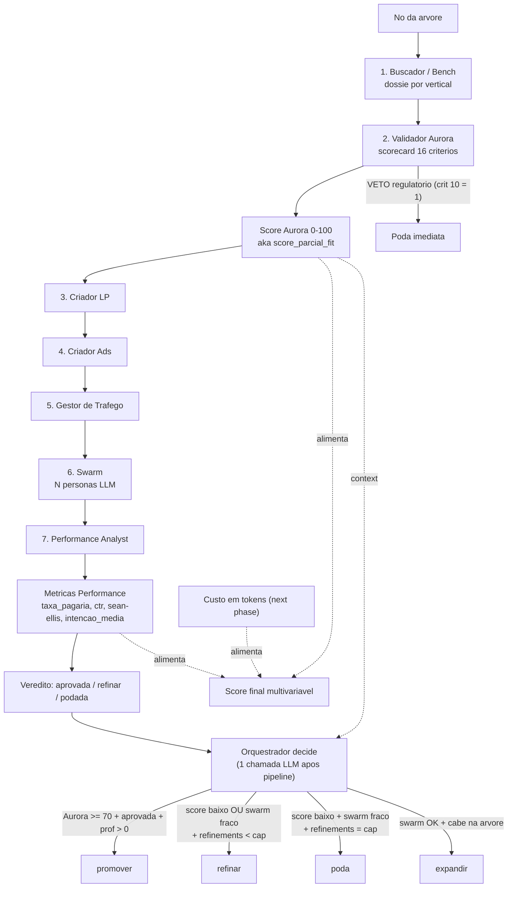
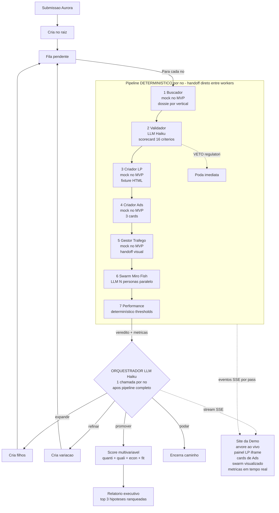

# Arquitetura — Autovalidador de Ideias em Escala
**Beyond Agents · Hackathon · Versão final consolidada**

---

## 1. Sumário executivo

Pipeline agêntico em padrão **híbrido** (prompt-chain dentro do nó + supervisor entre nós — §2.1) que recebe uma submissão (formulário de aplicação da Aurora preenchido pelo founder; modo prompt livre fica como next phase) e devolve um **score multivariável** após explorar uma **árvore de hipóteses**. Cada nó da árvore: gera **1 LP + 3 ads** (no MVP, fixtures rotativos), simula deploy/handoff de tráfego, dispara um swarm de **personas sintéticas (Miro Fish)** para validar tração, e devolve veredito ao Orquestrador, que decide **expandir, refinar, podar ou promover**. Toda a exploração é visualizada **ao vivo** em um site dedicado.

A solução **não substitui** decisão de investimento — alimenta o Comitê Aurora com dados que hoje custam pessoas + semanas, em **dias**. O input é o **formulário de submissão Aurora** (estruturado em 5 blocos: Founders, Solução, Progresso, Problema & Mercado, Expectativas — schema completo em §15), o que destrava o uso direto do scorecard oficial da Fase 1 e dá ao Validador Aurora evidência de campo para quase todos os critérios.

## 2. Princípios arquiteturais

1. **Padrão híbrido em dois níveis**, não Orchestrator-Workers puro. Dentro de cada nó da árvore o sistema usa um **prompt-chain determinístico** (espinha sequencial de 7 passos — §5) que passa output direto de um agente para o próximo, sem o Orquestrador no meio. **Entre nós**, o Orquestrador-Agente atua como **supervisor/router**: depois que o pipeline do nó termina, ele decide `expandir / refinar / podar / promover`. Essa separação é deliberada — pipeline interno auditável e barato; decisão entre nós agêntica e flexível. Workers do pipeline não negociam nem escolhem quem chamar; só fluem dados em cadeia fixa.
2. **Criador de Assets — design previsto vs MVP.** O design original é UM agente único com 4 skills (LP, ads, copy, roteiro) para coerência de mensagem. No MVP, LP e Ads são **mocks determinísticos separados** ([agents-platform/src/tools/criador-lp.ts](agents-platform/src/tools/criador-lp.ts) e [criador-ads.ts](agents-platform/src/tools/criador-ads.ts)) — fixtures rotativos sem coordenação de copy. O agente coordenado fica como "next phase".
3. **Stateless por execução**. Estado da árvore vive em-process por run. Sem persistência cross-execução no MVP.
4. **Caps como envelope, não como cérebro**. Profundidade, fan-out, budget e timeout são guard-rails determinísticos. Tudo o que está **dentro** do envelope é decisão agêntica.
5. **Não-automação da decisão final**. Sistema entrega score acionável. Comitê Aurora decide investimento. Isso é maturidade arquitetural, não limitação.

## 3. Inventário de agentes

Coluna **Tipo no MVP** reflete o que está implementado em [agents-platform/src/](agents-platform/src/) hoje; a coluna **Tipo previsto** reflete o design original. Onde há divergência, o MVP economiza tokens com mock determinístico e fica marcado como "next phase" em §14.

| # | Agente | Tipo no MVP | Tipo previsto | Função | Output |
|---|---|---|---|---|---|
| 1 | **Orquestrador** | Agente LLM (Haiku 4.5) | Igual | Cria nó raiz a partir da submissão e, **após cada nó terminar o pipeline** (§5), decide expandir/refinar/podar/promover. 1 chamada LLM por nó. Não entra no meio do pipeline. | Estado da árvore + decisão por nó |
| 2 | **Buscador / Análise de Concorrentes** | Determinístico (dossiê pré-fabricado por vertical) | Agente LLM | Valida e enriquece afirmações do founder: TAM/SAM/SOM, concorrentes, dores, tendências, auto-research jurídico. No MVP, fixtures por vertical em [pipeline-no.ts](agents-platform/src/workflows/pipeline-no.ts) (calibrados a partir de execuções LLM reais). | Dossiê consolidado para o Validador |
| 3 | **Validador Aurora** | Agente LLM (Haiku 4.5) | Igual | Consome submissão Aurora + dossiê do Buscador e roda o scorecard de 16 critérios (§4). VETO regulatório (critério 10 = nota 1) é o único gate duro. | Score parcial + critérios + tags + recomendação |
| 4a | **Criador de LP** | Determinístico (fixtures HTML rotativos) | Skill do Criador de Assets LLM | Gera 1 landing page. No MVP, [criador-lp.ts](agents-platform/src/tools/criador-lp.ts) escolhe 1 de 6 fixtures e injeta headline/subhead/CTA da hipótese. | HTML+Tailwind da LP |
| 4b | **Criador de Ads** | Determinístico (fixtures de 3 cards) | Skill do mesmo Criador de Assets | Gera 3 variações de ad. No MVP, [criador-ads.ts](agents-platform/src/tools/criador-ads.ts) escolhe 1 de 6 fixtures de 3 cards. **Não há coordenação de copy entre LP e Ads no MVP** — design original previa agente único garantindo coerência. | 3 ads renderizáveis na UI |
| 5 | **Gestor de Tráfego** | Determinístico (delay + handoff visual) | Agente LLM | Em produção, dispara campanhas reais no Meta/Google. No MVP, valida `lp_id`, simula propagação (~600ms) e emite `trafego_disparado` com `campanha_id`. | Trigger do Swarm |
| 6 | **Swarm (Miro Fish)** | N agentes LLM em paralelo (Haiku 4.5) | Igual | N personas sintéticas analisam a LP (HTML+copy) em paralelo. Cada uma responde intenção de compra (0-10), se pagaria, feedback qualitativo. Concorrência limitada (3 em vôo), retry com backoff em 429. | Pool de respostas por persona |
| 7 | **Análise de Performance** | Determinístico (thresholds) | Agente LLM | Agrega respostas do swarm e devolve veredito categórico. Lógica em [performance.ts](agents-platform/src/tools/performance.ts). | `taxa_pagaria`, `ctr_sintetico`, `intencao_media`, `sean_ellis_proxy`, `veredito` |

**Total no MVP:** 1 Orquestrador (LLM) + 2 workers LLM (Validador, Swarm) + 5 workers determinísticos (Buscador, LP, Ads, Tráfego, Performance) + N personas (8 no MVP, escalável a 200).

**Por que tanto determinístico no MVP?** Restrição de orçamento (~$2 USD para a demo) + foco em demonstrar o pattern e o ciclo (expandir/refinar/podar/promover) sem gastar tokens em tarefas onde o LLM agrega pouco frente ao custo (gerar LP a partir de fixture, agregar métricas, simular handoff). A migração desses agentes para LLM real está em §14 ("next phase").

## 4. Validador Aurora — o que ele vê e quando dá o "check"

O Validador Aurora é o **único agente que carrega conhecimento institucional da Beyond**. Ele é a tradução automatizada do scorecard que o Comitê de Inovação aplica hoje na Fase 1 (Screening) do [Playbook de Seleção](/Users/gplopes/Downloads/29a89955-04ab-47cf-bed9-cdd1a21077b7_Playbook_de_Seleo_.pdf).

### 4.1 Princípio: não é gate booleano

Ele **não decide** sozinho se a hipótese segue ou para. Em vez disso:

- Sempre roda até o fim, mesmo em ideias fracas.
- Atribui **notas por critério** com justificativa em texto.
- Calcula uma **nota parcial de fit estratégico** que alimenta a dimensão "Fit" do score multivariável (§9).
- Anexa **tags estruturadas** de aderência às teses (vertical, modelo, estágio).
- Devolve a **recomendação de corte do Playbook** ("descartar", "validar", "prioridade").
- Tem **uma única exceção que poda imediatamente**: veto regulatório (critério 10 com nota 1 — barreiras jurídicas que inviabilizam o modelo).

Isso preserva o princípio "não automatizamos o Comitê, alimentamos ele": o sistema sempre devolve um diagnóstico, mesmo quando ele recomenda descarte. A decisão final segue sendo humana.

### 4.2 Critérios aplicáveis ao nosso contexto

O scorecard do Playbook tem três camadas:

- **Geral** — 60% do peso final no Playbook original. Vale para qualquer fonte de oportunidade.
- **Específico por fonte** — 40%: Editais (PI, atestados técnicos, ROI burocrático…), Mercado/Inorgânico (perfil do founder, sinergia operacional…), Interno (disponibilidade do owner, dono da briga…).

**Mudança de premissa importante:** o autovalidador recebe como input o **formulário de submissão Aurora** preenchido pelo founder (schema completo em §15). O formulário traz bloco completo de Founders (background, trajetória, LinkedIn, conquistas, tempo de dedicação) e dados financeiros/operacionais (cash balance, burn rate, projeção, stack, canais). Isso destrava o uso dos critérios específicos de **Mercado/Inorgânico** e **Interno** — antes considerados fora do escopo. Editais continuam fora (exigem atestados, propriedade intelectual, fluxo burocrático que só faz sentido em submissão de proposta concreta).

**Critérios aplicáveis no MVP:** os 12 gerais + 4 específicos de Mercado/Inorgânico/Interno.

#### Scorecard geral (12 critérios)

Cada critério é uma **pergunta que o LLM responde** com base no formulário Aurora preenchido + dossiê do Buscador. A "Fonte de evidência" indica o campo do formulário que sustenta a nota — e quando o Buscador valida/desafia esse claim.

| # | Critério | Pergunta | Peso original | Fonte de evidência (formulário ↔ research) |
|---|---|---|---|---|
| 1 | Diferencial Injusto / Moat | A ideia tem tecnologia própria, dados ou posição de mercado defensáveis? | 10% | Campo *"Por que somos os melhores? Tecnologia própria, dados exclusivos, posição única?"* + validação cruzada com benchmark de concorrentes |
| 2 | Alinhamento de Tese | Está em vertical priorizada (LegalTech, EdTech, HealthTech, GovTech) ou gera valor para parceiros atuais do Extreme? | 10% | Campo *"Vertical"* (botão direto) + inferência do Validador a partir de Solução + Problema |
| 3 | Problema Real | Resolve dor latente e comprovada — não é "solução em busca de problema"? | 10% | Campos *"Qual dor latente esta solução resolve? Existem evidências?"* + *"Por que escolheu desenvolver essa ideia?"* + cross-check com swarm |
| 4 | TAM/SAM/SOM | O tamanho do prêmio vale o esforço? | 10% | Campo *"Qual TAM, SAM e SOM aproximado?"* declarado + validação do Buscador (estimativa de mercado) |
| 5 | Escalabilidade Tecnológica | Receita cresce sem aumento proporcional de custo (negócio de tecnologia, não de serviço)? | 10% | Campo *"Modelo permite crescimento sem aumento proporcional de custos?"* + Stack tecnológico declarado |
| 6 | Escalabilidade Pública (B2G) | Tem potencial em canal público / editais? | 10% | Vertical declarada + Expectativas (*"Contatos B2G"*) + inferência do Validador |
| 7 | Aproveitamento de Infra Beyond | Usa governança ou IA do grupo? | 5% | Campo *"É possível reduzir custos/CAC usando infra Beyond?"* (Sim/Não direto) |
| 8 | Velocidade MVP | Teste funcional viável em 1–4 semanas? | 10% | Campo *"É possível testar MVP em até 4 semanas?"* (texto + explicação) |
| 9 | Pesquisa Pesada vs Vibe Coding | Exige pesquisa demorada (não-trivial em IA)? | 5% | Campo *"Stack tecnológico"* + complexidade inferida pelo Validador |
| 10 | **Risco Regulatório — VETO** | Existem barreiras regulatórias/jurídicas que inviabilizam o modelo? Nota 1 aciona poda imediata. | 10% | Campo *"Existe alguma barreira legal imediata?"* (Sim/Não direto) + auto-research jurídico do setor |
| 11 | Conhecimento Interno | A Beyond já sabe fazer algo similar? | 5% | Stack declarado + comparação com portfólio Beyond/Aurora conhecido |
| 12 | Processo Comercial | O time comercial já sabe vender isso (canal aberto)? | 5% | Campo *"Possui acesso direto a canais de venda?"* + Background do founder (LinkedIn, histórico) |

#### Scorecard específico — Mercado / Inorgânico / Interno

| # | Critério | Pergunta | Peso original | Fonte de evidência (formulário) |
|---|---|---|---|---|
| 13 | Perfil do Founder | Owner tem perfil empreendedor, resiliência, foco em resultados? | 20% (do bloco) | Bloco Founders inteiro: Educação, Histórico de trabalho, LinkedIn, Conquistas |
| 14 | Dono da Briga | Há responsável claro que dedicará tempo necessário à incubação? | 20% | Campo *"Há quanto tempo cada um está trabalhando nisso?"* + Expectativas |
| 15 | Sinergia Operacional / CAC | Conseguimos reduzir custos ou CAC usando infra Beyond? | 20% | Mesmo do critério 7 (Sim/Não direto) — alta correlação |
| 16 | Canais de Venda | Owner tem acesso direto aos canais ou rede necessária para validar? | 20% | Mesmo do critério 12 — alta correlação |

Como os critérios 7&15 e 12&16 são altamente correlacionados, na prática o Validador **deduplica e ajusta peso** (regra de implementação: se ambos pontuam, peso médio entra duas vezes; se um é mais granular, prevalece).

**Reescalonamento de pesos:** como editais (40% da camada específica) ficam fora, o peso reescalonado fica em ~83% (60% gerais + 20% Mercado/Inorgânico). O Validador normaliza para 100 no output final.

### 4.3 Tags da Tese de Investimento Aurora

Além das notas, o Validador anexa **tags** baseadas na tese de investimento explícita da Aurora (também no Playbook de Seleção). Não pesam no score — pesam na leitura visual do nó na UI:

- `vertical-priorizada-{legaltech | edtech | healthtech | govtech}` ou `vertical-fora-da-tese`
- `modelo-{b2b | b2g | b2c}` (B2C ganha alerta "fora da tese explícita")
- `estagio-{ideacao | validacao | early-stage}`
- `conveniencia-pessoas` se a ideia bate com o propósito "produtos digitais que trazem conveniência para a vida das pessoas"

### 4.4 Recomendação de corte (oriunda do Playbook)

O Playbook define cortes objetivos para o score do screening — usamos os mesmos:

| Score parcial Aurora | Recomendação no Playbook | O que aparece na UI |
|---|---|---|
| `< 60` | Descartar ou colocar no backlog | Badge vermelha "Fora de tese" |
| `60 – 80` | Validar hipóteses específicas e amadurecer | Badge amarela "Validar" |
| `> 80` | Prioridade | Badge verde "Prioridade Aurora" |
| VETO acionado (critério 10 = 1) | Pausar | Nó podado imediatamente, motivo visível |

A recomendação aparece como rótulo no nó, mas **não bloqueia a continuação do pipeline** (exceto VETO). É um dos inputs que o Orquestrador-Agente considera ao decidir expandir/refinar/podar.

### 4.5 Input e output do agente

**Input** (JSON) — o formulário Aurora completo + a hipótese específica do nó da árvore + o dossiê do Buscador:

```json
{
  "submissao_aurora": {
    "founders": [
      {
        "nome": "...", "telefone": "...", "email": "...",
        "genero": "...", "data_nascimento": "...", "cidade": "...",
        "redes_sociais": "...",
        "educacao": "...", "historico_trabalho": "...",
        "linkedin": "...", "conquistas": "..."
      }
    ],
    "solucao": {
      "nome": "...",
      "descricao_50_chars": "...",
      "por_que_escolheu": "...",
      "vertical": "legaltech | edtech | healthtech | govtech | outra",
      "pitch_deck_url": "...",
      "video_demo_url": "..."
    },
    "progresso": {
      "tempo_de_trabalho": "...",
      "cash_balance_e_burn_rate": "...",
      "projecao_faturamento": "...",
      "stack_tecnologico": "...",
      "reduz_custos_com_infra_beyond": true,
      "mvp_em_4_semanas": "..."
    },
    "problema_mercado": {
      "por_que_essa_ideia": "...",
      "dor_latente_e_evidencias": "...",
      "publico_problema_solucao": "...",
      "diferencial_moat": "...",
      "concorrentes_e_lacunas": "...",
      "tam_sam_som": "...",
      "escalabilidade_sem_custo_proporcional": "...",
      "canais_de_venda": "...",
      "barreira_legal_imediata": false
    },
    "expectativas": {
      "convencimento": "...",
      "areas_de_ajuda": "..."
    }
  },
  "hipotese_no_no": "Foco em MEIs do setor de alimentação, canal WhatsApp",
  "dossie_buscador": {
    "concorrentes_validados": ["..."],
    "concorrentes_omitidos_pelo_founder": ["..."],
    "tam_sam_som_validado": "...",
    "dores_confirmadas": ["..."],
    "tendencias": ["..."]
  }
}
```

**Output** (JSON):

```json
{
  "score_parcial_fit": 72,
  "veto": false,
  "criterios": [
    {
      "id": "alinhamento_tese",
      "nota": 9,
      "peso_normalizado": 12.0,
      "fonte": "formulario.solucao.vertical = legaltech",
      "justificativa": "LegalTech é vertical priorizada explícita da Aurora."
    },
    {
      "id": "risco_regulatorio",
      "nota": 5,
      "peso_normalizado": 12.0,
      "veto": false,
      "fonte": "formulario.problema_mercado.barreira_legal_imediata = false (founder) + auto-research (validado)",
      "justificativa": "Founder declarou sem barreira. Auto-research confirmou: setor regulado pela OAB, mas com precedentes de orientação não-vinculante. Não veta."
    },
    {
      "id": "perfil_founder",
      "nota": 8,
      "peso_normalizado": 16.0,
      "fonte": "formulario.founders[0].historico_trabalho + linkedin",
      "justificativa": "Histórico de 7 anos em fintech, fundou empresa anterior, perfil empreendedor consistente."
    },
    "..."
  ],
  "tags": ["vertical-priorizada-legaltech", "modelo-b2b", "estagio-ideacao", "conveniencia-pessoas"],
  "recomendacao_playbook": "validar",
  "discrepancias_founder_vs_research": [
    {
      "campo": "tam_sam_som",
      "founder": "R$ 5Bi TAM",
      "research": "Estimativa do Buscador: R$ 800Mi - R$ 1.2Bi TAM",
      "severidade": "alta"
    }
  ]
}
```

Esse output plugga direto na **dimensão "Fit estratégico"** da fórmula do score multivariável final (§9), e cada `criterio` vira uma linha no painel lateral do nó na UI. O campo `discrepancias_founder_vs_research` é exibido como alerta visual — sinal importante de honestidade da submissão.

### 4.6 O que o Validador Aurora explicitamente NÃO faz

Fronteiras desenhadas de propósito:

- Não faz **due diligence** do founder (não conferimos LinkedIn manualmente, não cruzamos referências, não validamos diplomas). Avaliamos o perfil **como declarado no formulário**, com sinais auxiliares do auto-research. Confirmação de identidade e antecedentes continua sendo do time Aurora.
- Não calcula **modelagem financeira completa** — isso é a Fase 1 do [Playbook de Ongoing](/Users/gplopes/Downloads/202858a5-89c1-453d-8c67-f35048318bc7_Playbook_de_Ongoing_.pdf), que acontece **depois** do nosso autovalidador. Lemos o cash balance e a projeção que o founder declarou, mas não construímos a projeção 5a Triple-Triple-Double-Double-Double.
- Não verifica **atestados técnicos** nem propriedade intelectual de editais (relevante apenas para editais, fase posterior, exige documentação formal).
- Não decide **investimento** — sinaliza fit estratégico para o score final e para o Comitê humano.
- Não aprende sozinho — o scorecard é parametrizado; mudanças vêm do time Aurora, não do modelo.

Essa fronteira clara é parte da maturidade da solução: cada coisa no lugar certo.

## 5. Fluxo de uma hipótese (espinha sequencial)

Dentro de **cada nó da árvore** (uma hipótese), o pipeline é uma **cadeia determinística** (prompt-chain) de 7 agentes. O Orquestrador NÃO entra nesses 7 passos — ele só recebe o veredito ao fim, conforme §2.1. Ordem real implementada em [agents-platform/src/workflows/pipeline-no.ts](agents-platform/src/workflows/pipeline-no.ts):

```
[hipótese ativa]
   ↓
1. Buscador / Bench       → dossiê (alimenta o Validador)
   ↓
2. Validador Aurora       → score + tags + VETO se aplicável
   ↓                          (se VETO: poda imediata, sem rodar 3-7)
3. Criador de LP          → HTML da landing page (mock no MVP)
   ↓
4. Criador de Ads         → 3 cards de ads (mock no MVP)
   ↓
   (transição visual: estado do nó vira "deployada" — deploy real Vercel é next phase)
   ↓
5. Gestor de Tráfego      → handoff LP → Swarm (mock no MVP)
   ↓
6. Swarm (Miro Fish)      → N personas LLM analisam a LP em paralelo
   ↓
7. Análise de Performance → veredito + métricas (determinístico)
   ↓
[veredito devolve ao Orquestrador → decide expandir/refinar/podar/promover]
```

**Observação importante:** a ordem do quadro original era `Validador → Buscador`. O código inverte para `Buscador → Validador` porque o Validador consome o dossiê do Buscador para preencher o critério 10 (auto-research jurídico) e validar discrepâncias com o que o founder declarou. Essa inversão é intencional.

Ads são gerados, **renderizados como cards na UI**, mas **não publicados**. No pitch: *"a publicação está mapeada para a próxima fase; os assets já saem prontos."*

### 5.1 Decisões internas — dois scores, refinamento e promoção

A espinha acima esconde três pontos sutis que confundem na leitura rápida do fluxo: (a) o nó produz **dois scores independentes** que se combinam no score final; (b) **score baixo não é sentença automática** — existe caminho de refinamento; (c) o gate de **promoção tem números objetivos**. Esta seção explicita os três.

#### Diagrama corrigido



#### Os dois scores — não confundir

| `score_parcial_fit` (Validador Aurora) | Métricas (Performance Analyst) |
|---|---|
| Escala 0-100 | Cada métrica em sua escala própria |
| Vem do scorecard de 16 critérios sobre o formulário | Vem das respostas do swarm sintético à LP |
| Pesa fit estratégico, founder, vertical, moat, regulatório | Pesa intenção de compra, CTR sintético, sean-ellis |
| VETO regulatório é o único gate "duro" | Veredito categórico (`aprovada` / `refinar` / `podada`) |
| Entra no score final com peso `w4 = 0.35` | Entra com `w1·quanti = 0.30` + `w2·quali = 0.25` |

Ambos alimentam o `score_final` multivariável de §9 — independentemente. Score Aurora alto com swarm fraco devolve score final mediano; o inverso também. **A combinação é o sinal**, não cada um isolado.

#### Gates objetivos do Orquestrador

| Decisão | Gate objetivo |
|---|---|
| **Promover** | `score_parcial_fit ≥ 70` AND `veredito = aprovada` AND `profundidade > 0` |
| **Expandir** | `veredito = aprovada` AND `profundidade < MAX_DEPTH` AND `nos_totais + filhos ≤ MAX_NODES` |
| **Refinar** | `veredito = refinar` OR (`score_parcial_fit < 60` AND `taxa_pagaria > 0.5`) — limitado a `MAX_REFINEMENTS_POR_NO` (=1) |
| **Podar** | VETO regulatório (imediato) OR refinamentos esgotados sem aprovação |

Veredito do Performance Analyst (thresholds em [agents-platform/src/tools/performance.ts](agents-platform/src/tools/performance.ts)):

| Veredito | Gate |
|---|---|
| `aprovada` | `taxa_pagaria ≥ 0.30` AND `intencao_media ≥ 6.0` |
| `refinar` | `taxa_pagaria ≥ 0.15` (falhou em algum critério de aprovação) |
| `podada` | `taxa_pagaria < 0.15` |

#### Refinamento — score baixo não é sentença

Hipóteses com score Aurora baixo (< 60) **não são automaticamente podadas**. Se o swarm devolver sinal forte de compra (`taxa_pagaria > 0.5`), o Orquestrador pode acionar **refinamento**: a mesma tese, mas com nova LP + Ads (headline, subhead e CTA diferentes). O cap `MAX_REFINEMENTS_POR_NO = 1` garante que não viramos loop. A tese de fundo não muda — só a forma de comunicar.

A motivação é honesta: às vezes a oferta é boa e o problema é a copy. Refinar barato em 1 iteração tira essa dúvida sem gastar a árvore inteira.

## 6. Plano de controle — árvore de hipóteses

O Orquestrador-Agente mantém o estado da árvore e decide a cada veredito. Operações disponíveis:

- **Expandir nó**: gerar N sub-hipóteses (variações de público, ângulo, formato) — cria N filhos na fila pendente.
- **Refinar nó**: criar um nó-variação com nova headline/subhead/CTA na mesma tese — a variação volta a rodar o pipeline (passos 3-7 com nova LP).
- **Podar nó**: marcar como morto, encerrar exploração desse caminho.
- **Promover nó**: marcar como candidato ao score final.

Estados visíveis na UI por nó:

| Estado | Cor | Significado |
|---|---|---|
| `gerando` | cinza pulsando | Hipótese definida, assets em construção |
| `deployada` | azul | LP no ar, aguardando swarm |
| `validando` | animação | Miro Fish rodando |
| `aprovada` | verde | Passou nos thresholds |
| `refinando` | laranja | Voltou pro Criador para variação |
| `podada` | cinza riscado | Não bateu critério, encerrada |
| `promovida` | dourada | Top candidata ao score final |

## 7. Plano visual — site da demo

Esse é **o produto da apresentação**.

### Tela 1 — Home

No MVP existe **apenas o modo formulário Aurora**: a Home renderiza o formulário completo da Aurora em 5 blocos (Founders, Solução, Progresso, Problema & Mercado, Expectativas — schema em §15). Pode ser preenchido ao vivo ou pré-carregado a partir de um JSON (fixture `submissao-healthtech.json`).

> **Next phase:** modo "prompt livre" para o palco. Um campo único de texto, um agente auxiliar auto-completa os 5 blocos do formulário a partir do prompt + auto-research, e exibe o resultado para o avaliador conferir antes de seguir. Fora do escopo MVP — ver §14.

O que entra no Orquestrador é o JSON do formulário Aurora completo. Botão "Validar" navega para a tela da árvore.

### Tela 2 — Árvore ao vivo (centro)

Árvore interativa (React Flow), crescendo em tempo real conforme o orquestrador expande nós. Cada nó é card com:

- Título da hipótese.
- Estado visual (cor + animação).
- Métricas resumidas (conversão, intenção).

### Tela 3 — Painel lateral (ao clicar num nó)

Abre painel mostrando:

- **Iframe da LP** renderizada (a URL Vercel).
- **3 cards de Ads** gerados para essa LP, com badge "Pronto para publicação — próxima fase".
- **Feed ao vivo** das personas Miro Fish: cada análise aparece como uma linha ("Persona #47 — 28a, gerente de operações: *'achei interessante, mas não entendi o preço'*. Não converteu.").
- **Dashboard** de métricas em tempo real: bounce rate, scroll depth proxy, CTA click rate sintético, % que converteria.

### Tela 4 — Resultado final

Quando a árvore estabiliza (ou bate o cap):

- **Top 3 hipóteses ranqueadas** pelo score multivariável.
- **Relatório executivo** gerado (1 página) para o Comitê Aurora.
- **Custo total** da exploração (em tokens + tempo).

## 8. Caps e guard-rails

Envelope determinístico que protege a demo e o budget. Valores reais em [agents-platform/src/lib/tipos.ts → `CAPS_DEFAULT`](agents-platform/src/lib/tipos.ts).

| Parâmetro | Valor MVP | Valor previsto (doc original) | Por quê o ajuste |
|---|---|---|---|
| `MAX_DEPTH` | 2 (raiz → filhos → netos) | 2 | Sem mudança |
| `MAX_FAN_OUT` | **2** sub-hipóteses | 3 | Reduzido para caber em 2-3 min de demo sem perder o ciclo |
| `MAX_NODES` | **6** | ~10-12 | Reduzido pelo mesmo motivo |
| `PERSONAS_POR_LP` | **8** | 50-200 | Redução grande — trade-off explícito de significância estatística por velocidade de demo. Custo por nó cai linearmente; em produção volta para 50+ |
| `MAX_REFINEMENTS_POR_NO` | 1 por nó | 1 | Sem mudança |
| `TIMEOUT_POR_NO_MS` | 90.000 (90s) | 90s | Sem mudança |
| `TOKEN_BUDGET_POR_NO` | sem enforcement | 50k | Hoje o [cost-tracker](agents-platform/src/lib/cost-tracker.ts) só observa; não há gate por nó. Custo total observado fica ~$0.50-1.50 por run dependendo da árvore |

Os caps **não bloqueiam** a apresentação visual — eles **garantem** que a árvore cresça até um tamanho demonstrável e pare em tempo apresentável. Caps são **intocáveis pelo LLM**: se o Orquestrador pede ação que estoura cap, o código (`explorar-arvore.ts`) força ação compatível (em geral `promover` ou `podar`).

## 9. Score multivariável final

A saída final agrega 4 dimensões (alinhada com o que a Aurora já usa no Vesting 1):

| Dimensão | O que mede | Fonte | Peso MVP |
|---|---|---|---|
| **Quantitativos** | `taxa_pagaria * 0.6 + ctr_sintetico * 0.4` | Swarm + Performance Analyst | `w1 = 0.30` |
| **Qualitativos** | `sean_ellis_proxy * 0.5 + (intencao_media/10) * 0.5` | Swarm + Performance Analyst | `w2 = 0.25` |
| **Econômicos** | **Proxy fixo `0.7`** no MVP — em produção viria de CAC estimado + LTV + custo real em tokens por nó | (placeholder; cost-tracker já captura USD por agente mas não entra no score ainda) | `w3 = 0.10` |
| **Fit estratégico** | `score_parcial_fit / 100` | Validador Aurora | `w4 = 0.35` |

Fórmula real em [explorar-arvore.ts → `calcularScoreFinal`](agents-platform/src/workflows/explorar-arvore.ts):

```
score_final = (0.30·quanti + 0.25·quali + 0.10·econ + 0.35·fit) * 100   → 0-100
```

**Aurora pesa 35% e Performance pesa 55% (quanti+quali). São inputs independentes que se combinam — não há substituição entre eles.** Score Aurora alto com swarm fraco devolve score final mediano; o inverso também.

> **Next phase:** trocar o proxy `econ = 0.7` por um cálculo real usando o cost-tracker por nó (já implementado em [cost-tracker.ts](agents-platform/src/lib/cost-tracker.ts), só falta agregar). Pesos viram slider na UI para o avaliador re-ranquear ao vivo.

## 10. Stack técnica

Tudo TypeScript. Stack realmente implementada no MVP:

| Camada | Escolha MVP | Escolha prevista (doc original) | Observação |
|---|---|---|---|
| **Frontend** | Vite + React 18 + Zustand + Tailwind 3 | Next.js + Tailwind + shadcn/ui | Vite escolhido por boot mais rápido na demo; sem SSR necessário |
| **Árvore visual** | React Flow 11 | React Flow | Sem mudança |
| **Realtime** | SSE (Server-Sent Events) | Socket.io ou Liveblocks | SSE basta — fluxo é unidirecional backend → UI |
| **Backend** | Node 20 + Express 5 + Anthropic SDK | Mastra ou Vercel AI SDK | Mastra está instalado mas o pipeline usa chamadas diretas via [anthropic-client.ts](agents-platform/src/lib/anthropic-client.ts) com cost-tracker |
| **Deploy de LPs** | **Não implementado** (estado `deployada` é só marcador visual) | Vercel API | Fora do escopo do MVP — ver §14 |
| **Modelos LLM** | **Claude Haiku 4.5 único** ($1/1M in, $5/1M out) | Sonnet 4 workers + Haiku/GPT-4o-mini personas | Restrição de orçamento (~$2 USD para a demo). Sonnet/Opus proibidos no MVP |
| **Estado** | Em-process por run | Em-process ou Redis | Sem persistência cross-execução; refresh do server apaga tudo |
| **Concorrência** | 1 run ativa por vez no backend | — | Evita rate-limit cumulativo do org Anthropic |

## 11. Diagrama final

Padrão híbrido com loop explícito de controle. O Orquestrador (1 chamada LLM por nó, após o pipeline completo) decide `expandir / refinar / promover / podar` e realimenta a fila — `expandir` cria filhos, `refinar` cria variação, `promover` finaliza no score, `podar` encerra o caminho. Workers do pipeline fazem handoff direto entre si; o Orquestrador NÃO entra no meio.



**Leitura do diagrama:**

- **Entrada:** `Submissao Aurora` → `Cria no raiz` → entra na `Fila pendente`.
- **Loop principal:** para cada nó da fila, roda o pipeline determinístico de 7 agentes (LP, Ads, Tráfego e Performance são mocks no MVP — ver §3). Workers fazem handoff direto entre si, sem o Orquestrador no meio.
- **VETO regulatório:** se o Validador (passo 2) acionar VETO (critério 10 = nota 1), o nó vai direto para `Poda imediata` sem rodar os passos 3-7.
- **Decisão pós-pipeline:** `Performance` devolve `veredito + métricas` para o Orquestrador (1 chamada LLM). Quatro saídas:
  - `expandir` → cria filhos na fila (até `MAX_FAN_OUT`, respeitando `MAX_NODES` e `MAX_DEPTH`).
  - `refinar` → cria variação do mesmo nó com nova LP+Ads (até `MAX_REFINEMENTS_POR_NO`).
  - `promover` → alimenta o `Score multivariavel` final.
  - `podar` → encerra esse caminho da árvore.
- **Saídas terminais:** quando o loop termina (fila vazia ou caps estourados), o `Score multivariavel` (Aurora + Performance + econ + fit — §9) alimenta o `Relatorio executivo` com top 3 hipóteses ranqueadas.
- **Stream SSE:** o Orquestrador emite eventos de decisão; cada passo do pipeline emite eventos de progresso. Ambos vão para o `Site da Demo` em tempo real (contrato completo em §7 do CONTEXTO).

## 12. Cronograma para amanhã (10–12 horas, 4–5 pessoas)

| Trilha | Owner | Tempo | Entregável |
|---|---|---|---|
| **Backend agêntico** — orquestrador + 6 workers em Mastra/Vercel SDK | 2 pessoas | 5h | Pipeline completo rodando em CLI |
| **Miro Fish** — pool de personas + perguntas estruturadas + agregação | 1 pessoa | 4h | Swarm sintético contra qualquer LP, devolvendo métricas |
| **Frontend** — Next.js + React Flow + Socket.io + iframe LPs | 1–2 pessoas | 6h | Site mostrando árvore ao vivo + painel LP/Ads |
| **Deploy de LPs** — integração Vercel API | 1 pessoa (parcial) | 2h | LP gerada vira URL pública em segundos |
| **Integração ponta a ponta + testes** | Todos | 2h | Tudo conectado, demo rodando |
| **Roteiro + rehearsal** | 1 pessoa em paralelo | 2h | Script de 5 min + plano B se algo travar |

**Caminho crítico**: Miro Fish (mais arriscado, começa cedo) + WebSocket orquestrador → frontend (integração mais frágil). Trabalhar esses dois em paralelo desde a hora 1.

## 13. Pontos do pitch que vendem maturidade

- **"Padrão híbrido — prompt-chain dentro do nó, supervisor entre nós"**: mostra que o time entende a taxonomia (Anthropic "Building Effective Agents") e escolheu o pattern certo pra cada nível. Pipeline interno é auditável e barato; decisão entre nós é agêntica e flexível.
- **"Caps determinísticos como envelope, decisão agêntica dentro"**: combina o melhor dos dois mundos, foge do antipadrão "agente faz tudo".
- **"Ads gerados, não publicados — próxima fase"**: honesto sobre o escopo do hackathon, sem prometer o que não está pronto.
- **"Não substituímos o Comitê Aurora, alimentamos ele"**: posicionamento maduro contra automação cega.
- **"Score multivariável, não veredito binário"**: pega o insight do Rodrigo sobre produtos com retorno modesto + custo baixíssimo de validação.
- **"Dois scores independentes (Aurora + Performance) combinados no final"**: fit estratégico não substitui sinal de mercado e vice-versa.
- **"~$0.10–0.20 por hipótese vs. semanas de pessoa"**: número claro de ROI para o júri.

## 14. O que ficou fora deliberadamente (mostrar no pitch como "next phase")

- Publicação real de ads no Meta/Google.
- **Deploy real das LPs** via Vercel API (hoje só estado visual `deployada`).
- **Modo prompt livre** na Tela 1 (hoje só modo formulário Aurora — §7).
- **Buscador, Criador de LP/Ads, Gestor de Tráfego e Performance como agentes LLM** — todos rodam determinísticos no MVP (§3). A migração para LLM real está mapeada.
- **Criador de Assets como agente único coordenado** com 4 skills (LP, Ads, copy, roteiro) — design previsto em §2.2 que garantiria coerência de copy entre LP e Ads.
- **`econ` no score multivariável vindo do cost-tracker real** — hoje é proxy fixo `0.7` em [explorar-arvore.ts](agents-platform/src/workflows/explorar-arvore.ts). Cost-tracker já existe e captura tokens/USD; falta agregar por nó e penalizar no score.
- Plano paralelo de Tendências contínuas (na demo, snapshot pré-coletado alimenta o Buscador).
- Loop de refinamento profundo (na demo, máximo 1 refinamento por nó).
- Persistência cross-execução (na demo, estado em-process; refresh do servidor apaga tudo).
- Avaliação de performance dos próprios ads (só LP via swarm).
- **Modelos premium (Sonnet/Opus)** — proibidos no MVP por restrição de orçamento (~$2 USD). Pipeline já é compatível, só falta liberar verba.

Cada um desses é uma frase no pitch: *"a v2 adiciona X, mapeada e estimada."*

## 15. Esquema do formulário Aurora (input do sistema)

O formulário de submissão da Aurora é o **input canônico** do autovalidador. Ele tem 5 blocos sequenciais, e cada campo carrega evidência direta para os critérios do scorecard. O Validador Aurora consome o JSON completo; o Buscador valida e enriquece; o Criador de Assets puxa contexto de produto e público; o Score Final usa os dados econômicos.

### 15.1 Blocos do formulário

**1. Founders** (lista, ≥1, com botão "Adicionar"):

- *Básico*: Nome completo, Telefone, Email, Gênero, Data de nascimento, Cidade, Redes sociais.
- *Background e trajetória*: Educação, Histórico de trabalho, LinkedIn, Conquistas que se orgulha.

**2. Solução**:

- Nome da solução.
- Descrição em ≤50 caracteres.
- Por que escolheu essa ideia + experiência prática.
- **Vertical** (botão): LegalTech / EdTech / HealthTech / GovTech / Outra.
- Pitch Deck (URL, opcional).
- Vídeo de Demo até 5min (URL, opcional).

**3. Progresso**:

- Há quanto tempo cada founder está trabalhando nisso.
- Cash balance atual e burn rate mensal (previsão aceita se ainda não fatura).
- Projeção de faturamento (números + premissas).
- Stack tecnológico (incluindo modelos de IA e ferramentas de programação IA).
- **É possível reduzir custos / CAC usando a infra de IA e automação da Beyond?** (Sim/Não).
- **É possível testar MVP em até 4 semanas?** (Sim/Não + explicação).

**4. Problema & Mercado**:

- Por que essa ideia + como sabe que as pessoas precisam.
- Qual dor latente + evidências/dados que comprovam.
- "Para [Públicos/Clientes] que têm [Problema], oferecemos [Solução/Produto]" (pitch one-liner).
- **Por que somos os melhores?** Tecnologia própria, dados exclusivos, posição única.
- Principais concorrentes + o que eles ainda não entenderam.
- TAM, SAM, SOM aproximado.
- O modelo permite crescimento de receita sem aumento proporcional de custos?
- Possui acesso direto a canais de venda?
- **Existe alguma barreira legal imediata?** (Sim/Não).

**5. Expectativas**:

- O que convenceu a aplicar ao modelo de Venture Builder da Beyond.
- Em quais áreas espera receber mais ajuda (Vendas, Desenvolvimento, Jurídico, Contatos B2G…).

### 15.2 Mapeamento campo ↔ critério do scorecard

Resumo de quais campos sustentam quais critérios do scorecard (§4.2). Pode ser usado pelo Validador como prompt-template — ele sabe ler diretamente cada campo.

| Critério | Campo principal | Fonte secundária |
|---|---|---|
| 1. Moat | *Por que somos os melhores?* | Stack tecnológico, Background do founder |
| 2. Alinhamento de Tese | *Vertical* | Solução + Problema |
| 3. Problema Real | *Dor latente + evidências* | *Por que essa ideia* |
| 4. TAM/SAM/SOM | *TAM/SAM/SOM aproximado* | Validação do Buscador |
| 5. Escalabilidade Tec | *Modelo permite crescimento sem aumento proporcional* | Stack |
| 6. Escalabilidade Pública | *Vertical* + *Expectativas (B2G)* | — |
| 7. Infra Beyond | *Reduz custos/CAC com infra Beyond?* (booleano) | — |
| 8. Velocidade MVP | *MVP em 4 semanas?* | Stack |
| 9. Pesquisa vs Vibe | Stack tecnológico | — |
| **10. VETO Regulatório** | ***Barreira legal imediata?*** (booleano) | Auto-research jurídico |
| 11. Conhecimento Interno | Stack | Comparação com portfólio Beyond |
| 12. Processo Comercial | *Acesso direto a canais de venda?* | Histórico de trabalho do founder |
| 13. Perfil do Founder | Bloco Founders completo (Histórico, LinkedIn, Conquistas) | Auto-research em redes |
| 14. Dono da Briga | *Tempo de trabalho* + *Expectativas* | — |
| 15. Sinergia Operacional | *Reduz custos/CAC com infra Beyond?* | — |
| 16. Canais de Venda | *Acesso direto a canais* | Background |

### 15.3 Por que o formulário é arquiteturalmente importante

Três motivos:

1. **Encaixe nativo com o funil Aurora.** Não inventamos um input artificial — usamos o **mesmo formulário** que founders já preenchem hoje quando submetem para o Comitê. O autovalidador passa a ser uma camada que **plugga** entre "submissão" e "Comitê", sem fricção de adoção.
2. **Evidência por campo, não por inferência.** Para cada critério do scorecard, há um campo do formulário que é a **fonte primária**. Isso aumenta drasticamente a qualidade da nota — o Validador não está chutando, está lendo o que o founder declarou e cruzando com o auto-research.
3. **Sinais de honestidade.** O cruzamento entre o que o founder afirmou (no formulário) e o que o Buscador descobriu (no auto-research) gera o campo `discrepancias_founder_vs_research` no output do Validador. Discrepâncias grandes (ex.: TAM 5x maior que a realidade) viram **sinal qualitativo** que o Comitê leva em consideração.

---

**Status**: arquitetura aprovada para implementação. Próximo passo: specs detalhadas por agente (input/output JSON, skill prompts, modelo) sob demanda.
