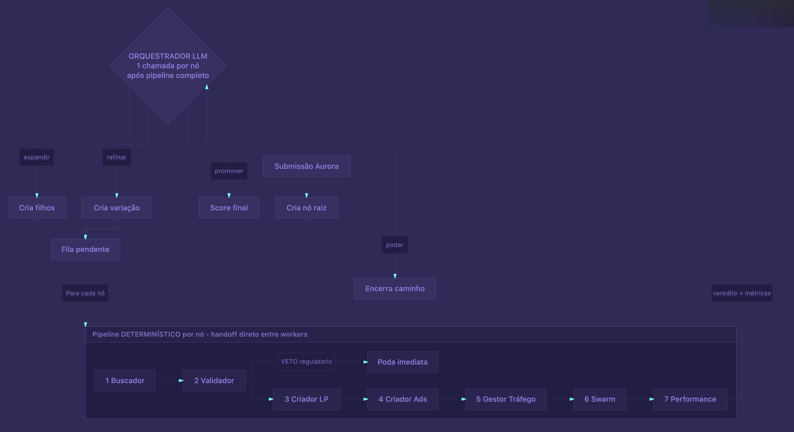

# Autovalidador de Ideias em Escala — Visão Consolidada

> Documento de referência que consolida as conversas com Rodrigo e Guedes, as anotações de produto e a arquitetura agêntica decidida. Material de trabalho para o hackathon Beyond Agents.
>
> **Para detalhes técnicos de implementação**, ver [Arquitetura - Autovalidador de Ideias.md](./Arquitetura%20-%20Autovalidador%20de%20Ideias.md).

---

## 1. Contexto: Beyond + Aurora

**Beyond** é uma startup de startups — a venture builder do Extreme Group. O propósito desde a fundação é funcionar como uma "fábrica de startups", lançando novos produtos em ritmo industrial.

**Aurora** é a Business Unit dentro da Beyond responsável pela fase inicial dessa esteira: pegar uma hipótese de negócio e validar se ela tem potencial real de escala antes de transferir para o Venture Studio (que cuida do ciclo de escala) ou para a Volund (squad de desenvolvimento).

O problema é que, na prática, a Beyond não tem mais conseguido ser essa fábrica. O motivo é simples: **validar uma ideia hoje ainda é caro**. Mesmo com a Aurora estruturada, cada hipótese consome pessoas, semanas de desenvolvimento e ciclos de 90 dias antes de gerar um sinal claro de go/no-go. A capacidade real de teste por trimestre é baixa — e isso limita quantas apostas o grupo consegue colocar na rua.

## 2. O problema que estamos atacando

A tese central, que veio do Guedes na conversa, é:

> O desafio hoje não é construir. É descobrir o que as pessoas querem.

Com IA generativa, transformar uma transcrição de conversa com cliente em PRD funcional virou trivial. O custo marginal de **executar** caiu. O que continua caro — e arriscado — é **escolher o que executar**.

Hoje a Aurora resolve isso parcialmente com dois grandes momentos de decisão (descritos no Playbook de Seleção e no Playbook de Handover):

1. **Antes do investimento** — Scorecard de Screening (Fase 1) decide se uma oportunidade entra ou não no funil.
2. **Depois de 90 dias** — Comitê de Inovação avalia KPIs do Vesting 1 e decide entre escalar, prorrogar 30 dias, pivotar ou matar.

Ambos os momentos exigem trabalho humano significativo: preenchimento do scorecard, montagem da modelagem financeira, construção de LP, mídia paga, coleta de métricas de tração. Esse trabalho é o que limita o número de hipóteses simultâneas que o grupo consegue carregar.

**O que queremos atacar:** o trecho entre a chegada de uma ideia e a primeira leitura confiável de mercado. Hoje isso custa pessoas + semanas + dinheiro. Queremos que custe poucos reais e poucos dias.

## 3. A solução: autovalidador de ideias em escala

Em uma frase:

> Um pipeline agêntico que recebe uma ideia em texto, se contextualiza sozinho sobre o problema, monta hipóteses, gera os artefatos de marketing (LP, anúncios, copies), expõe as LPs a usuários sintéticos em paralelo, mede tração simulada e devolve um score acionável — antes do primeiro real de investimento.

Os cinco princípios da solução:

1. **Validador em escala** — não validamos uma ideia por vez; testamos N hipóteses em paralelo.
2. **Pipeline automático** — uma vez disparado pelo prompt inicial, o ciclo roda sem intervenção humana até o relatório final.
3. **Auto-research / auto-contextualização** — o sistema se munia de dores, concorrentes, tendências e benchmarks por conta própria.
4. **Closed loops com limite combinado** — cada hipótese roda em ciclo de geração → exposição → avaliação → refinamento, dentro de um envelope (1 refinamento por nó, orçamento de tokens, profundidade máxima) que garante que o sistema sempre converge em tempo apresentável.
5. **Árvore de hipóteses com poda automática** — a partir de uma ideia raiz, o sistema ramifica em sub-hipóteses, mata os nós fracos por critérios objetivos e converge para um conjunto pequeno de propostas com alta confiança.

A saída final **não é binária**. É um score multivariável que leva em conta:

- Potencial de retorno financeiro estimado.
- Custo de validação consumido.
- Sinais de tração observados (intenção de compra dos usuários sintéticos, engajamento com a copy, conversão proxy na LP).
- Fit com as teses Aurora (verticais priorizadas, modelo de negócio, perfil do founder quando aplicável).

## 4. Onde encaixa no fluxo atual da Aurora

A solução não substitui a governança da Aurora. Ela **alimenta** os dois pontos de decisão mais caros do processo atual com dados que hoje só existem depois de muito trabalho humano.

| Momento atual | O que a Aurora faz hoje | Onde nossa solução entra |
| --- | --- | --- |
| **Fase 1 — Screening (Playbook de Seleção)** | Scorecard manual com critérios gerais (diferencial injusto, alinhamento de teses, problema real, TAM/SAM/SOM, escalabilidade, etc.) e critérios específicos por fonte de oportunidade (editais, mercado, interno). Decisão do Comitê. | Pré-screening automático: o **Validador Aurora** lê o **formulário de submissão Aurora** preenchido pelo founder (mesmo formulário usado hoje pela Aurora — Founders, Solução, Progresso, Problema & Mercado, Expectativas) e roda o scorecard sobre ele antes do humano olhar, já com auto-research e benchmark de concorrentes anexados como validação. |
| **Fase 5 — Validação Comercial dos 90 dias (Playbook de Ongoing)** | Founders + Growth montam LP, kit do investidor, ativam canais, rodam mídia paga, medem conversão, churn, intenção de compra. | Primeira leitura de mercado feita pelo pipeline em **dias, não em 90**: LP gerada, anúncios prontos para subir, métricas coletadas via usuários sintéticos e devolvidas como score. Mídia paga real entra na próxima fase do produto. A Aurora continua dona da decisão final. |
| **D90 — Comitê de Inovação** | Decide entre escalar, prorrogar 30 dias, pivotar ou matar com base nos KPIs do Vesting 1 e sinais qualitativos. | Aceleramos o sinal que chega no comitê. O comitê continua existindo e decidindo. |

O Rodrigo confirmou esse encaixe na conversa, quase nessas palavras: "criando para o primeiro momento é super tranquilo de aplicar; no segundo basicamente muda o resultado e compara com indicadores". Em outras palavras, **o algoritmo de classificação e seleção já está pronto** — a Aurora já sabe como avaliar uma ideia. O que falta é uma forma de gerar os inputs dessa avaliação sem queimar pessoas.

Importante registrar: nossa solução **não automatiza a decisão final** de investimento. Ela automatiza a coleta e organização do material que sustenta a decisão.

## 5. Arquitetura agêntica (visão de alto nível)

A solução é organizada em três planos:

- A **espinha** — o pipeline que cada hipótese percorre, do recebimento ao veredito.
- O **plano de controle** — um Orquestrador-Agente que gerencia a árvore de hipóteses e decide quando expandir, refinar ou podar nós.
- A **camada visual** — o site da demo, que mostra tudo acontecendo ao vivo.

### 5.1 A espinha: o pipeline de uma hipótese

Para cada hipótese sendo testada, o sistema executa esta sequência:

1. **Validador Aurora** — é o único agente que carrega conhecimento institucional da Beyond. Recebe como input o **formulário de submissão Aurora** preenchido pelo founder (mesmo formulário usado hoje pela Aurora, com 5 blocos: Founders, Solução, Progresso, Problema & Mercado, Expectativas) e roda sobre ele uma versão automatizada do **scorecard do Playbook de Seleção**, avaliando 12 critérios gerais:

   - **Diferencial / Moat**, **Alinhamento de Tese** (verticais priorizadas: LegalTech, EdTech, HealthTech, GovTech), **Problema Real**, **TAM/SAM/SOM**, **Escalabilidade Tecnológica**, **Escalabilidade Pública (B2G)**, **Aproveitamento de Infra Beyond**, **Velocidade do MVP**, **Pesquisa vs Vibe Coding**, **Risco Regulatório**, **Conhecimento Interno**, **Processo Comercial**.

   Como o formulário já traz o bloco completo de Founders (background, trajetória, LinkedIn, conquistas, tempo de dedicação), o Validador também consegue avaliar **critérios específicos de Mercado/Inorgânico** que antes ficariam fora do escopo: **Perfil do Founder**, **Dono da Briga**, **Sinergia Operacional/CAC**, **Canais de Venda**. Cada nota tem como fonte primária um campo concreto do formulário e validação cruzada com o auto-research.

   Não é gate booleano — sempre roda até o fim e atribui **nota por critério** com justificativa, **tags de tese** (vertical, modelo, estágio), e a **recomendação do Playbook** ("descartar" se score `< 60`, "validar" se `60–80`, "prioridade" se `> 80`). A única exceção é o **veto regulatório**: se a ideia tem barreira jurídica que inviabiliza o modelo (campo "Existe alguma barreira legal imediata?" do formulário, confirmado por auto-research), o nó é podado imediatamente.

   Como subproduto valioso, o Validador emite alertas de **discrepância entre o que o founder afirmou e o que o auto-research validou** (ex.: TAM declarado 5x maior que a estimativa de mercado). Isso é sinal qualitativo que vai junto do score.

   O que continua **fora do escopo**: due diligence formal do founder (não conferimos diplomas, não cruzamos referências), modelagem financeira 5a completa (isso é Fase 1 do Ongoing, posterior), e atestados técnicos para editais (exige submissão de proposta concreta).

   Detalhe completo do agente, com os pesos e o JSON de input/output, em [Arquitetura - Autovalidador de Ideias.md §4](./Arquitetura%20-%20Autovalidador%20de%20Ideias.md). Esquema completo do formulário Aurora em [§15](./Arquitetura%20-%20Autovalidador%20de%20Ideias.md).
2. **Buscador / Análise de Concorrentes** — a partir do dossiê do formulário, **valida e enriquece** o que o founder afirmou: confere TAM/SAM/SOM declarado contra estimativas independentes, confronta a lista de concorrentes informada com benchmark de mercado (identificando players que o founder omitiu ou desconhece), valida a dor declarada com sinais externos, levanta tendências do segmento. Em vez de levantar tudo do zero como na ideia original, agora **estresse-testa o que está no formulário** — trabalho que hoje consome dias de pessoa.
3. **Criador de Assets** — um único agente com **múltiplas habilidades** (LP, anúncios, copy, roteiro). Foi uma escolha consciente manter tudo num agente só, em vez de criar um agente por tipo de artefato: assim a LP, os anúncios e os copies de uma mesma hipótese falam **a mesma língua** e carregam a mesma promessa de valor. Ele produz por hipótese:
   - 1 Landing Page (LP) em HTML.
   - 3 anúncios visuais (variações de ângulo, copy e público-alvo).
   - Copy de cada peça.
   - Roteiro de vídeo curto (se houver tempo na demo).
4. **Deploy automático da LP** — a LP gerada vira uma URL pública em segundos (via Vercel).
5. **Gestor de Tráfego** — em vez de subir os anúncios em mídia paga real (Meta / Google), o que levaria dias só para aprovação e janela mínima de coleta, dispara um **swarm sintético** contra a LP.
6. **Miro Fish (swarm de personas sintéticas)** — entre 50 e 200 "usuários" sintéticos analisam cada LP. Cada um tem perfil, idade, dor, intenção de compra declarada — e responde a perguntas estruturadas: achou interessante? clicaria no CTA? pagaria? por quê? O agregado dessas respostas vira métrica.
7. **Analisador de Performance** — agrega as respostas do swarm, compara com thresholds objetivos e devolve um veredito ao Orquestrador: a hipótese está performando, precisa de refinamento ou deve ser podada.

Sobre os anúncios: **eles são gerados como assets reais** (imagem + copy) e exibidos na apresentação como cards visuais associados a cada LP, com a badge "Pronto para publicação — próxima fase". **No hackathon, não são publicados** em Meta Ads, com toda a integração mapeada para a v2. A leitura de mercado vem do swarm sintético na LP, que é suficiente para o conceito e para o primeiro filtro.

### 5.2 O plano de controle: Orquestrador-Agente e a Árvore de Hipóteses

Acima do pipeline existe um **Orquestrador-Agente** que:

- Recebe a ideia raiz.
- Quebra em sub-hipóteses (variações de público-alvo, ângulo, formato, canal).
- Dispara o pipeline para cada nó da árvore — em paralelo, não em fila.
- A cada veredito que volta, decide: **expandir** o nó em sub-hipóteses, **refinar** (gerar variação), ou **podar** (encerrar aquele caminho).
- Emite eventos em tempo real para a interface visual.

Importante: o Orquestrador **é um agente** (modelo LLM tomando decisões), não código rígido. As decisões de expansão e poda são feitas pelo raciocínio do modelo a partir das métricas e do estado da árvore.

O que **é determinístico** são apenas os limites do palco: profundidade máxima de 2 níveis, até 3 sub-hipóteses por nó, ~10–12 nós no total, 1 refinamento por nó, e um orçamento de tokens por nó. Esses limites garantem que a árvore cresça até um tamanho **demonstrável** e pare em tempo apresentável — sem trair o caráter agêntico das decisões internas.

### 5.3 O plano paralelo: snapshot de tendências

A versão original previa um Agente de Tendências rodando continuamente em background. No MVP do hackathon, isso virou um **snapshot pré-coletado** de tendências, referências de mercado e formatos de anúncio, que o Criador de Assets consulta ao gerar variações. Na próxima fase do produto, esse plano vira um agente contínuo coletando tendências em tempo real — exatamente como planejado originalmente — sem mudar a arquitetura.

### 5.4 A camada visual: o site da demo

Toda a exploração acontece **ao vivo** em um site dedicado. Esse é o produto principal da apresentação:

- A **árvore de hipóteses cresce visualmente** na frente de quem assiste, conforme o Orquestrador expande nós.
- Cada nó muda de cor conforme o estado: cinza pulsando (gerando) → azul (LP deployada) → animação (validando com swarm) → verde (aprovada) / laranja (refinando) / cinza riscado (podada).
- Ao clicar em qualquer nó, abre um painel lateral mostrando:
  - A **LP renderizada** num iframe (a URL Vercel real, que qualquer um pode abrir em outra aba).
  - Os **3 anúncios gerados** como cards, com badge "Pronto para publicação — próxima fase".
  - O **swarm do Miro Fish acontecendo em tempo real**: feed de respostas das personas ("Persona #47, 28 anos, gerente de operações: *'achei interessante, mas não entendi o preço'*. Não converteu."), com métricas (conversão proxy, intenção de compra, bounce rate) atualizando enquanto as personas analisam.
- Ao final do run: **top 3 hipóteses ranqueadas** pelo score multivariável + **relatório executivo** de uma página, pronto para o Comitê Aurora.

### 5.5 Diagrama

Visão visual completa: Orquestrador-Agente no topo decidindo `expandir / refinar / promover / podar`, fila pendente alimentando o pipeline determinístico de 7 agentes (Buscador → Validador → Criador LP → Criador Ads → Gestor de Tráfego → Swarm → Análise de Performance), com veredito + métricas voltando ao Orquestrador. Detalhes técnicos por seção em [Arquitetura - Autovalidador de Ideias.md](./Arquitetura%20-%20Autovalidador%20de%20Ideias.md).

## 6. Score final — multivariável, não binário

A saída não é "vale" ou "não vale". É um score composto, alinhado com os indicadores que a Aurora já usa hoje no Vesting 1:

- **Sinais quantitativos** — conversão proxy de LP (visitante sintético → lead → conversão), intenção de compra acima de threshold, taxa de cliques sintética nas CTAs.
- **Sinais qualitativos** — proxy automatizado para Sean Ellis (% que ficaria "muito decepcionado" sem a solução), feedback estruturado das personas que interagiram com a LP.
- **Sinais econômicos** — CAC estimado, range de LTV, custo total da validação no nosso pipeline (em tokens convertidos para reais).
- **Fit estratégico** — aderência às teses da Beyond/Extreme, presença em vertical priorizada (LegalTech, EdTech, HealthTech, GovTech), encaixe com modelo B2B/B2G.

A vantagem de um score sobre um veredito binário é exatamente o ponto que o Rodrigo levantou: um produto pode ter retorno financeiro modesto, mas custo de validação tão baixo que ainda vale a pena. O score precisa carregar essa nuance para o Comitê.

## 7. Inspirações e referências

- **Miro Fish — agora parte central, não inspiração.** Ferramenta open source citada pelo Rodrigo. Um engenheiro chinês criou em 10 dias um simulador que roda milhares de agentes de IA conversando entre si e tomando decisões. Originalmente usado para simulação de cenário político. **No nosso pipeline, virou o mecanismo principal de leitura de mercado** para o MVP: o swarm de personas sintéticas analisa cada LP e devolve métricas comparáveis a uma exposição real. Na próxima fase, **soma-se** à mídia paga real, sem substituí-la — a validação sintética continua tendo papel como primeiro filtro (mais barato, mais rápido) antes do tráfego pago.
- **Benchmark de concorrentes como habilidade dedicada** — já existe um agente sendo construído na Beyond para fazer benchmark de LPs de concorrentes e extrair melhores práticas. Reaproveitável como habilidade do Buscador.
- **Esteira agêntica da Volund** — o framework de Ongoing já fala em "esteira agêntica de desenvolvimento". Nossa solução é coerente com essa direção arquitetural do grupo.

## 8. Próximos passos para o hackathon

**Decisões já tomadas** (detalhadas no doc de arquitetura técnica):

- Padrão arquitetural: **Orquestrador-Agente + agentes especialistas** (não enxame colaborativo — para garantir auditabilidade e demo previsível).
- **Criador é um único agente com múltiplas habilidades** (LP, 3 ads, copy, roteiro), não um agente por artefato — para manter coerência de mensagem.
- **Miro Fish** é o mecanismo de leitura de mercado no MVP; mídia paga real fica como entrega da próxima fase.
- **Anúncios são gerados como assets reais**, mostrados na UI como cards, mas não publicados.
- **Limites da árvore** (envelope do palco): 2 níveis de profundidade, 3 sub-hipóteses por nó, ~12 nós totais, 1 refinamento por nó.
- **Stack TypeScript ponta a ponta**: Next.js + Tailwind + shadcn + React Flow (árvore visual) + Socket.io (tempo real) + Mastra ou Vercel AI SDK (agentes) + Vercel (deploy das LPs).

**Ainda em aberto** (resolver na manhã do hackathon):

1. **Caso da demo** — escolher 1 ideia real da Beyond (ou uma ideia plantada que represente caso típico do funil Aurora) para a apresentação.
2. **Validar com Rodrigo** o scorecard simplificado do Validador Aurora — se pode ser exatamente o do Playbook de Seleção ou uma versão enxuta para a demo.
3. **Dividir o time por trilha**: backend agêntico (orquestrador + 6 workers), Miro Fish (pool de personas + agregação), frontend visual (árvore + painel + WebSocket), integração + deploy, roteiro do pitch.
4. **Roteiro de apresentação** — sequência de 5 minutos cobrindo: problema da Aurora hoje, demo ao vivo da árvore crescendo, painel de uma LP com swarm rodando, score multivariável final, posicionamento como input ao Comitê Aurora (não substituto), e o que fica para a próxima fase (publicação real, Agente de Tendências contínuo, mais profundidade na árvore).
